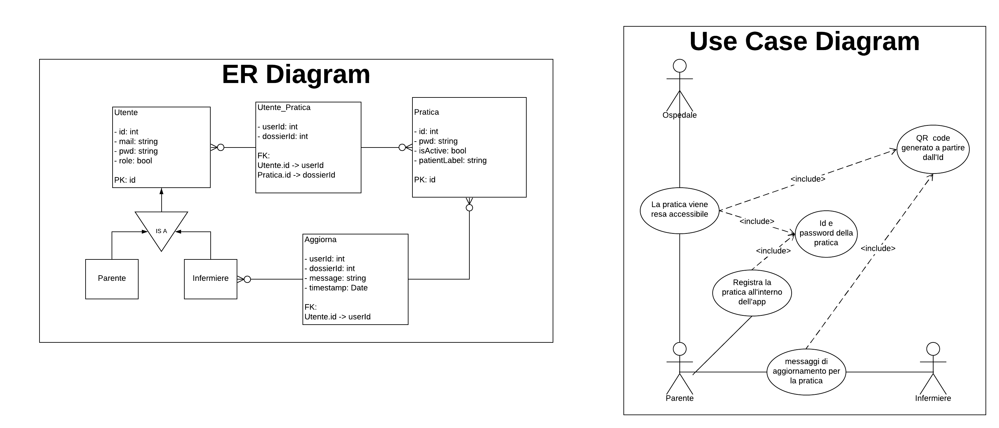

# Hackathon CodeVsCovid
The outcome of 3 days of work to fight the spreading of COVID-19.

## Requirements
- Python 3.7 or later
- npm
- pip

## API documentation
You can find the API documentation(OpenApi _.yaml_ file) in the __backend__ directory

## Use Cases and database model
